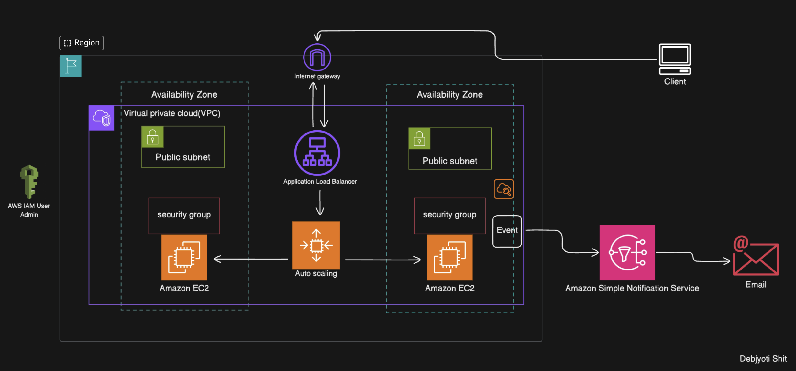

# 🚀 AWS Scalable Infrastructure with Monitoring and Alerts

[](https://choosealicense.com/licenses/mit/)
[](https://aws.amazon.com/)
[](CONTRIBUTING.md)

A robust, production-ready AWS infrastructure implementing auto-scaling across multiple availability zones with enhanced security and monitoring capabilities.

## 🎯 Features

- **High Availability**: Deployment across multiple AWS Availability Zones
- **Auto Scaling**: Automatic scaling based on demand metrics
- **Load Balancing**: Application Load Balancer for traffic distribution
- **Security**: VPC with public/private subnets and security groups
- **Monitoring**: Integrated event monitoring and notification system
- **IAM Integration**: Secure access management with AWS IAM

## 🏗️ Architecture



### Architecture Components

- **VPC Configuration**: Multi-AZ setup with public and private subnets
- **Load Balancer**: Application Load Balancer for traffic distribution
- **Auto Scaling**: EC2 auto-scaling groups for dynamic capacity
- **Security Groups**: Configured for maximum security
- **Internet Gateway**: Managed internet access
- **Event System**: Automated monitoring and notification


## 📸 Deployment Screenshots

<div class="screenshot-gallery">
   
    <div class="screenshot-box">
        
       
    </div>
<div class="screenshot-box">
        
       
    </div>
</div>

<style>
.screenshot-gallery {
    display: grid;
    grid-template-columns: repeat(2, 1fr);
    gap: 1rem;
    margin: 1rem 0;
}

.screenshot-box {
    background: #fff;
    border: 1px solid #eee;
    border-radius: 8px;
    overflow: hidden;
}

.screenshot {
    width: 100%;
    height: auto;
    border-bottom: 1px solid #eee;
}

.caption {
    padding: 0.5rem;
    margin: 0;
    text-align: center;
    font-size: 0.9rem;
    color: #666;
}

@media (max-width: 768px) {
    .screenshot-gallery {
        grid-template-columns: 1fr;
    }
}
</style>

## 🚀 Deployment Guide

### Prerequisites

- AWS CLI installed and configured
- IAM user with appropriate permissions
- Git installed on your local machine

### Installation Steps

1. Clone the repository:
```bash
git clone https://github.com/yourusername/aws-autoscaling-app.git
cd aws-autoscaling-app
```

2. Configure AWS credentials:
```bash
aws configure
```

3. Deploy the infrastructure:
```bash
# Install required packages on EC2 instances
amazon-linux-extras install epel -y
yum install stress -y

# Test auto-scaling trigger (optional)
stress --cpu 1 --timeout 800 &
```

## 🔍 Monitoring

The application includes comprehensive monitoring through:
- CloudWatch Metrics
- Auto Scaling Events
- Load Balancer Logs
- Custom Event Notifications

## 🛡️ Security

- VPC isolation
- Security group rules
- IAM role-based access
- SSL/TLS encryption
- Regular security audits

## 📊 Performance

The architecture is designed to handle:
- High-traffic loads
- Sudden traffic spikes
- Seamless scaling
- Zero-downtime deployments

## 👤 Developer

<div align="center">
  
  <h3>Debjyoti Shit</h3>

</div>

<style>
.developer-profile {
  text-align: center;
  padding: 20px;
  background: linear-gradient(145deg, #f6f8fa, #ffffff);
  border-radius: 10px;
  box-shadow: 0 4px 6px rgba(0, 0, 0, 0.1);
}

.profile-image {
  border-radius: 50%;
  border: 4px solid #ffffff;
  box-shadow: 0 0 20px rgba(0, 0, 0, 0.1);
}

.social-links {
  display: flex;
  justify-content: center;
  gap: 15px;
  margin-top: 15px;
}
</style>

## 📝 License

This project is licensed under the MIT License - see the [LICENSE.md](LICENSE.md) file for details.

## 🤝 Contributing

Contributions are always welcome! Please read the [contribution guidelines](CONTRIBUTING.md) first.

## 📞 Contact

- GitHub: [Debjyoti2004](https://github.com/Debjyoti2004)
- LinkedIn: [Debjyoti Shit](www.linkedin.com/in/debjyotishit)
- Email: debjyotishit27@gmail.com

## ⭐ Support

If you found this project helpful, please consider giving it a star! It helps others discover the project.

---
<div align="center">
Made with ❤️ by Debjyoti Shit
</div>